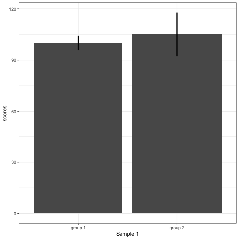
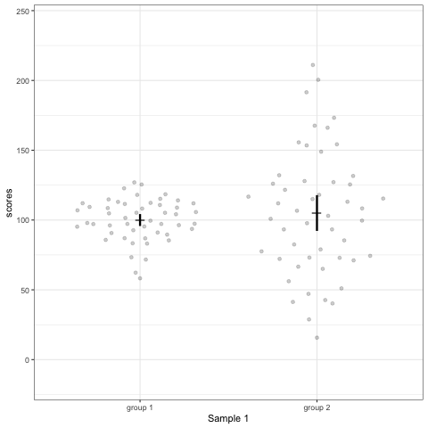
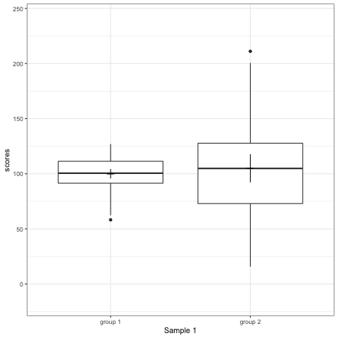

```{r setup, include=FALSE}
options(htmltools.dir.version = FALSE,
        eval = TRUE, warning = FALSE, message = FALSE)
knitr::opts_chunk$set(warning = FALSE, message = FALSE, fig.retina = 3, fig.asp = 0.8, fig.width = 7, out.width = "120%")
library(tidyverse)
library(gt)
library(gtExtras)
library(palmerpenguins)
library(wesanderson)
library(rstatix)

```


class: title-slide, left, top

# `r rmarkdown::metadata$title`

## `r rmarkdown::metadata$subtitle`

### `r rmarkdown::metadata$author`

<br>


<span style='color:white;'>Slides released under</span> [CC-BY 2.0](https://creativecommons.org/licenses/by/2.0/)&nbsp;&nbsp;`r fontawesome::fa("creative-commons", "white")``r fontawesome::fa("creative-commons-by", "white")` ]   


<div style = "position: absolute;top: 0px;right: 0px;"></img></div>


---

## Understanding data

We have to really understand our data to be able to decide on the appropriate analyses to answer our research questions. It can also lead to unexpected & interesting research questions. That requires first **looking** at your data, usually in a number of ways, to ask questions like: 

- Are there interesting patterns, groups, trends or relationships?

- How are observations distributed?

- Are there outliers?

- Is there notable bias in observations or missing observations? 

---

class: center, middle

### Always start a data analysis by thinking about it really hard before analyzing

--

## EVERY TIME

---

## Understand your data

- Is each column in the appropriate data type? Factor, character, dbl, integer?

- Are the columns and names easy to use/understand?

- Basic data cleaning/ tidy data formatting

---

class: center, middle, inverse

## Univariate analysis

---

## Jitter plots

Show values of observations within a group, adding some amount of “jitter” so that they don’t all overlap 

.left-code[
```{r, eval = FALSE}
ggplot(penguins, aes(x = species,
                     y = body_mass_g))+
  geom_jitter(alpha = 0.4,
              width = 0.1,
              aes(colour = species),
              show.legend = FALSE)+
  scale_color_brewer(palette = "Dark2")+
  labs(x = "",
       y = "Body mass (g)")+
  theme_light()
```
]

.right-plot[
```{r, echo = FALSE, out.width = "80%"}
ggplot(penguins, aes(x = species,
                     y = body_mass_g))+
  geom_jitter(alpha = 0.4,
              width = 0.1,
              aes(colour = species),
              show.legend = FALSE)+
  scale_color_brewer(palette = "Dark2")+
  labs(x = "",
       y = "Body mass (g)")+
  theme_light()
```
]


---

## Swarm plots

Show values of observations where amount of jitter is density dependent

.left-code[
```{r, eval = FALSE}
library(ggbeeswarm)#<<
ggplot(penguins, aes(x = species,
                     y = body_mass_g))+
  geom_beeswarm(alpha = 0.4,#<<
              width = 0.1,
              aes(colour = species),
              show.legend = FALSE)+
  scale_color_brewer(palette = "Dark2")+
  labs(x = "",
       y = "Body mass (g)")+
  theme_light()
```
]

.right-plot[
```{r, echo = FALSE,  out.width = "80%"}
library(ggbeeswarm)
ggplot(penguins, aes(x = species,
                     y = body_mass_g))+
  geom_beeswarm(alpha = 0.4,
              width = 0.1,
              aes(colour = species),
              show.legend = FALSE)+
  scale_color_brewer(palette = "Dark2")+
  labs(x = "",
       y = "Body mass (g)")+
  theme_light()
```
]

---

## Density plots

Show values of observations where amount of jitter is density dependent

.left-code[
```{r, eval = FALSE}
library(ggridges)#<<
ggplot(penguins, aes(x = body_mass_g,
                     y = species))+
  geom_density_ridges(alpha = 0.4,#<<
              width = 0.1,
              aes(fill = species),
              show.legend = FALSE)+
  scale_fill_brewer(palette = "Dark2")+
  labs(y = "",
       x = "Body mass (g)")+
  theme_light()
```
]

.right-plot[
```{r, echo = FALSE,  out.width = "80%"}

library(ggridges)
ggplot(penguins, aes(x = body_mass_g,
                     y = species))+
  geom_density_ridges(alpha = 0.4,
              width = 0.1,
              aes(fill = species),
              show.legend = FALSE)+
  scale_fill_brewer(palette = "Dark2")+
  labs(y = "",
       x = "Body mass (g)")+
  theme_light()
```

]

---

## Density plots

.left-code[
```{r, eval = FALSE}

penguins %>% 
  drop_na(sex) %>% 
ggplot(aes(x = body_mass_g,
                     y = species))+
  geom_density_ridges(alpha = 0.4,
              width = 0.1,
              aes(fill = sex))+#<<
  scale_fill_brewer(palette = "Dark2")+
  labs(y = "",
       x = "Body mass (g)")+
  theme_light()
```
]

.right-plot[
```{r, echo = FALSE,  out.width = "80%"}


penguins %>% 
  drop_na(sex) %>% 
ggplot(aes(x = body_mass_g,
                     y = species))+
  geom_density_ridges(alpha = 0.4,
              width = 0.1,
              aes(fill = sex))+
  scale_fill_brewer(palette = "Dark2")+
  labs(y = "",
       x = "Body mass (g)")+
  theme_light()
```
]

---

```{r, echo = FALSE, out.width = "80%"}
penguins |> 
    mutate(species=factor(species, levels=c("Adelie",
                                            "Gentoo",
                                            "Chinstrap"))) |> 
    # set as factor and provide levels
    ggplot()+
    geom_bar(aes(x=species),
             fill="steelblue",
             width=0.8)+
    labs(x="Species",
         y = "Number of observations")+
    coord_flip()+
    theme_minimal()
```

---

## Univariate analysis

Continuous variables:

Understand skew, outliers

Factorial variables:

Relative abundances, number of categories

All: 

Missing values

---

## QQplots

```{r}
x_values <- seq(2700,6300, 100)

norm_mass <- dnorm(x_values,
      mean = 4201.754,
      sd = 801.9545) |> 
  as_tibble()

density <- tibble(x_values, norm_mass)

penguins |> 
ggplot()+
  geom_histogram(aes(x=body_mass_g, y = ..density..),
               alpha=0.8,
               bins = 10,
               fill="steelblue",
               colour="darkgrey")+
  geom_line(data = norm_mass, aes(x =x_values, y = value))+
  labs(x = "Body mass (g)",
       y = "Count")

```

---

## QQplots

.left-code[

What is a qq plot?

- "Q" stands for quantile, and a qqplot is a probability plot for comparing two distributions by plotting their quantiles against each other

- quantile equals cutting the range of a probability distribution into equal chunks. e.g. 4 quantiles = quartiles

]

.right-plot[

```{r, message = FALSE, echo = FALSE}
penguins %>%  
  pull(body_mass_g) %>% 
  car::qqPlot()

```

]

---

## QQplot

.left-code[


- A qqplot compares the quantiles of a distribution against a theoretical distribution (usually the normal distribution). 

- Can be used to see whether a dataset deviates from the normal distribution and in what way? Commonly used to determine whether statistical models fit the data well. 

]

.right-plot[

```{r, message = FALSE, echo = FALSE}
penguins %>% 
  pull(body_mass_g) %>% 
  car::qqPlot()

```

]

---

## QQplot

.left-code[

```{r, eval = T, echo = F}
x_values <- seq(2700,6300, 100)

norm_mass <- dnorm(x_values,
      mean = 4201.754,
      sd = 801.9545) |> 
  as_tibble()

density <- tibble(x_values, norm_mass)

penguins |> 
ggplot()+
  geom_histogram(aes(x=body_mass_g, y = ..density..),
               alpha=0.8,
               bins = 10,
               fill="steelblue",
               colour="darkgrey")+
  geom_line(data = norm_mass, aes(x =x_values, y = value))+
  labs(x = "Body mass (g)",
       y = "Count")

```

]

.right-plot[

```{r, message = FALSE, echo = FALSE}
penguins %>% 
  pull(body_mass_g) %>% 
  car::qqPlot()

```

]

---

## Think about groupings

Here - variable **is** normally distributed *within* populations

```{r, echo = FALSE, out.width = "30%"}

penguins |> 
  group_split(species) |> 
  walk(~ pull(.x, body_mass_g) 
      |> car::qqPlot())

```


---

class: center, middle, inverse

## Multivariate analysis

---

## Scatter plots

Show relationships between two measured variables

.left-code[
```{r, eval = FALSE, out.width="80%"}
ggplot(penguins, aes(x = bill_length_mm,
                     y = bill_depth_mm))+
  geom_point(alpha = 0.4)+
  geom_smooth(method = "lm")+#<<
  scale_color_brewer(palette = "Dark2")+
  labs(x = "Bill length (mm)",
       y = "Bill depth (mm)")+
  theme_light()
```
]

.right-plot[

```{r, echo = FALSE,  out.width="80%"}
ggplot(penguins, aes(x = bill_length_mm,
                     y = bill_depth_mm))+
  geom_point(alpha = 0.4)+
  geom_smooth(method = "lm")+#<<
  scale_color_brewer(palette = "Dark2")+
  labs(x = "Bill length (mm)",
       y = "Bill depth (mm)")+
  theme_light()
```
]

---

# Why can't we just calculate summary statistics (e.g. mean?)

```{r, echo = FALSE, fig.align = "center", out.width="30%", fig.cap = "Originally created by Alberto Cairo in Download the Datasaurus: Never trust summary statistics alone; always visualize your data"}
knitr::include_graphics("images/dino.png")
```


---

# Why can't we just calculate summary statistics (e.g. mean?)

.plot-right[

```{r, echo = FALSE, fig.align = "center", out.width="40%", fig.cap = "Originally created by Alberto Cairo in Download the Datasaurus: Never trust summary statistics alone; always visualize your data"}
knitr::include_graphics("images/datasaurus.png")
```
]

.left-code[

All of these datasets have the same x & y mean, the same x& y SD

**Summary stats hide information**

]

---

.pull-left[


```{r, echo = FALSE, fig.show='hold',fig.align='center', out.width ="60%"}

```
]

.pull-right[
```{r, echo = FALSE, fig.show='hold',fig.align='center', out.width ="60%"}

```


]

```{r, echo = FALSE, fig.show='hold',fig.align='center', out.width ="40%"}

```


---

## Association

When we look at data, how do we describe the strength of the relationship between the dependent and independent variable?   Correlation


```{r, echo = FALSE, out.width="70%", fig.alt = "Strength of correlation", fig.align = "center"}
knitr::include_graphics("images/association_strength.png")
```

---

Exploratory Data Analysis and Data visualisation MUST be the starting point before applying any formal tests. 

Correlation analysis assumes a linear relationship, but while the figure on the right would produce a low *r* value, the strength of association is HIGH.


```{r, echo = FALSE, out.width="70%", fig.alt = "Strength of correlation"}
knitr::include_graphics("images/non_linear.png")
```

---

## When there is TOO much overlapping data

```{r, echo = FALSE, out.width = "70%"}
ggplot(penguins, aes(x = bill_length_mm,
                     y = bill_depth_mm))+
  geom_hex()+
  scale_fill_viridis_c()+
  labs(x = "Bill length (mm)",
       y = "Bill depth (mm)")+
  theme_light()
```

---

## Simpson's Paradox


.left-code[
```{r, eval = F}
library(ggpubr)#<<

ggplot(penguins, aes(x = bill_length_mm,
                     y = bill_depth_mm))+
  geom_point(alpha = 0.4)+
  geom_smooth(method = "lm")+#<<
  scale_color_brewer(palette = "Dark2")+
  labs(x = "Bill length (mm)",
       y = "Bill depth (mm)")+
  theme_light()+
  stat_cor(method = "pearson", #<<
           label.x = 33, #<<
           label.y = 15,
           p.accuracy = 0.001)#<<
```

]

.right-plot[

```{r, echo = F}
library(ggpubr)#<<

ggplot(penguins, aes(x = bill_length_mm,
                     y = bill_depth_mm))+
  geom_point(alpha = 0.4)+
  geom_smooth(method = "lm")+#<<
  scale_color_brewer(palette = "Dark2")+
  labs(x = "Bill length (mm)",
       y = "Bill depth (mm)")+
  theme_light()+
  stat_cor(method = "pearson", #<<
           label.x = 33, #<<
           label.y = 15,
           p.accuracy = 0.001)#<<

```

]

---

.left-code[


```{r, eval = F}
ggplot(penguins, aes(x = bill_length_mm,
                     y = bill_depth_mm,
                     colour = species,
                     fill = species))+
  geom_point(alpha = 0.4)+
  geom_smooth(method = "lm")+#<<
  scale_color_brewer(palette = "Dark2")+
  scale_fill_brewer(palette = "Dark2")+
  labs(x = "Bill length (mm)",
       y = "Bill depth (mm)")+
  theme_light()+
  stat_cor(method = "pearson", #<<
           label.x = 25,
           p.accuracy = 0.001)#<<

```

]

.right-plot[


```{r, echo = F}
ggplot(penguins, aes(x = bill_length_mm,
                     y = bill_depth_mm,
                     colour = species,
                     fill = species))+
  geom_point(alpha = 0.4)+
  geom_smooth(method = "lm",
              show.legend=FALSE)+#<<
  scale_color_brewer(palette = "Dark2")+
  scale_fill_brewer(palette = "Dark2")+
  labs(x = "Bill length (mm)",
       y = "Bill depth (mm)")+
  theme_light()+
  stat_cor(method = "pearson", #<<
           label.x = 25,
           p.accuracy = 0.001,
           show.legend = FALSE)
```


]

---

# Pairs plots

.left-code[

```{r, eval = FALSE}
library(GGally)#<<
penguins |> 
  ggpairs(columns = 3:6, ggplot2::aes(colour = species))
```
]

.right-plot[

```{r, echo = FALSE}
library(GGally)#<<
penguins |> 
  ggpairs(columns = 3:6, ggplot2::aes(colour = species))
```

]

